## KINEM Distributable Version

1. KINEM.EXE was programmed and compiled in Turbo C 3.0 to run under the MS-DOS 16-bit operating system. Due to this, the EXE cannot run directly on modern 64-bit operating systems.
2. However, you can use a DOS emulator like DOSBox to run KINEM.EXE.
3. You can find the distributable version of KINEM and the necessary files to run the program in a ZIP file in this repository. The file is: **KINEM.zip**.
4. Throughout this document, the nomenclature: `<Z:\command parameter>` indicates the execution of a command in the DOSBox emulator (**DOSBox.exe**).

## Installing and Setting-Up DOSBox Emulator

1. Download DOSBox from Sourceforge ([https://sourceforge.net/projects/dosbox](https://sourceforge.net/projects/dosbox))
2. In Windows, run the installer (**DOSBox0.74-3-win32-installer.exe**) to install DOSBox in a folder like *C:\DOSBox*.
3. Unzip **KINEM.zip** into a folder like *C:\DOS\KINEM*.
4. Execute **c:\DOSBox\DOSBox.exe**.
5. Change the DOSBox keyboard layout configuration according to your language. Set *language_code* as follows:
   1. For a permanent update, modify the file **C:\Users\<USER>\AppData\Local\DOSBox\dosbox-0.74-3.conf**. Inside the file, find and set *keyboardlayout=language_code* (where *language_code* can be: *es*, *en*, ..., etc.).
   2. For a session change, modify the keyboard layout directly in the command line once DOSBox is running by issuing: `<keyb language_code>` (e.g., `keyb es` command).

## Executing KINEM.EXE in DOSBox

1. DOSBox's default drive letter is *Z:*. To run KINEM and any other DOS program, *mount* your local folder inside the DOSBox virtual environment by issuing: `<mount C C:\DOS>`.
2. If you dont find the keys for *: (colon)* and *\ (slash)* characters despite keyboard-layout configuration use the ASCII code: `<ALT+58 for : >` and `<ALT+92 for \ >`.
3. Once the KINEM local folder is *mounted* in DOSBox, you can access it directly by issuing:
   1. `<C:\>` and pressing [ENTER].
   2. Then issue: `<cd KINEM>` [ENTER].
   3. Finally, issue: `<KINEM.EXE>` [ENTER].
4. KINEM.EXE will start as shown in the screenshots below.

|

___

## KINEM Execution (Screenshots)

|

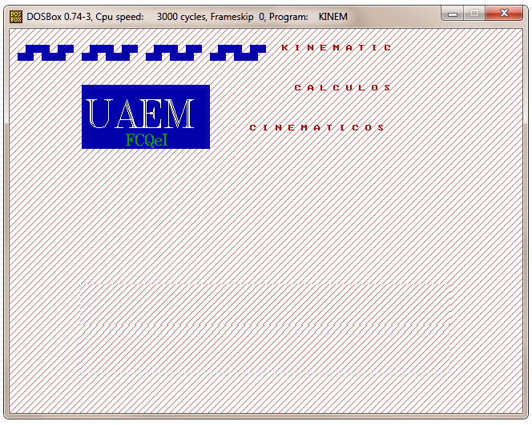

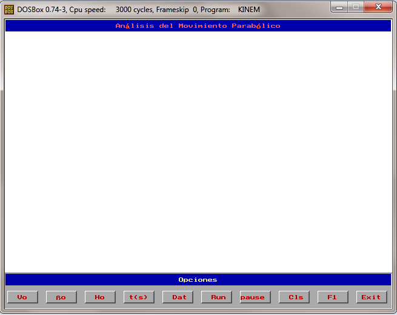

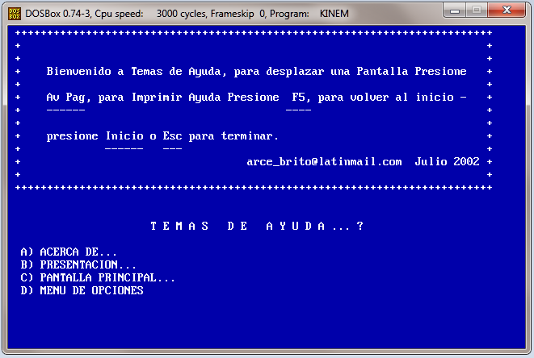

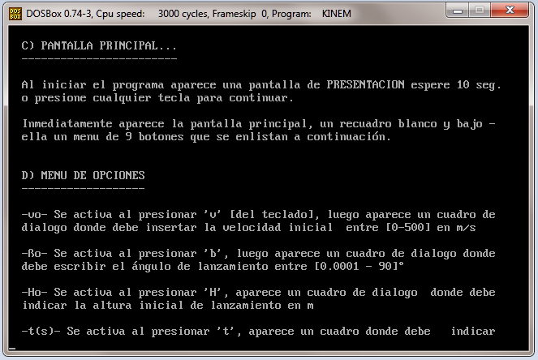

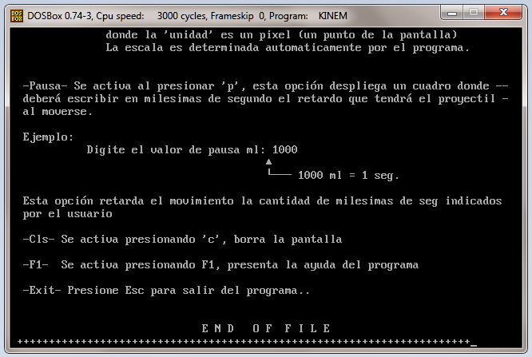

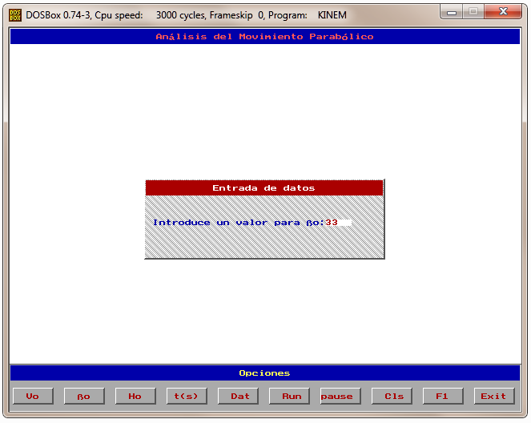

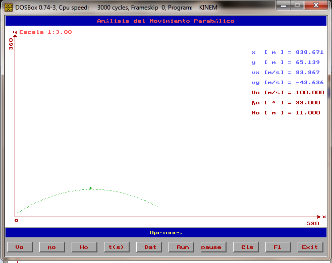

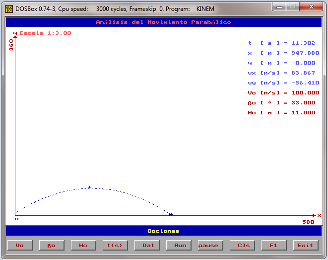

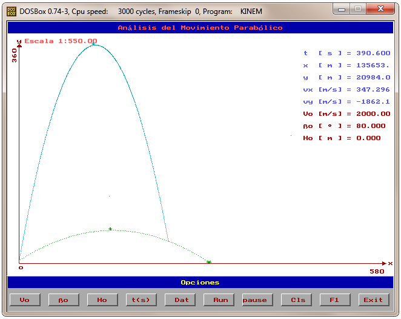

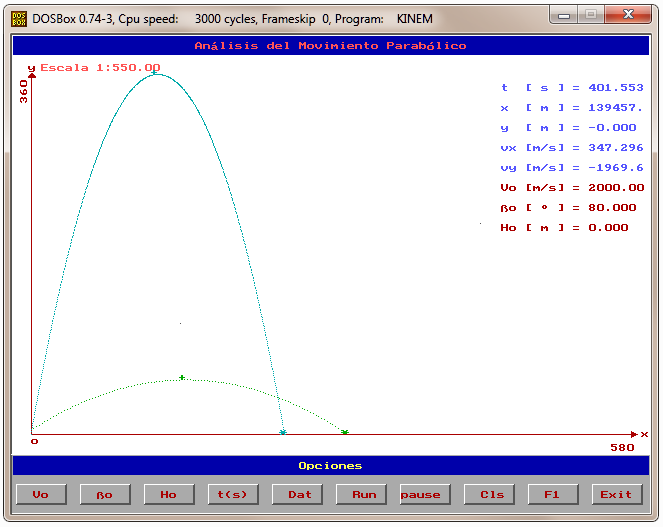

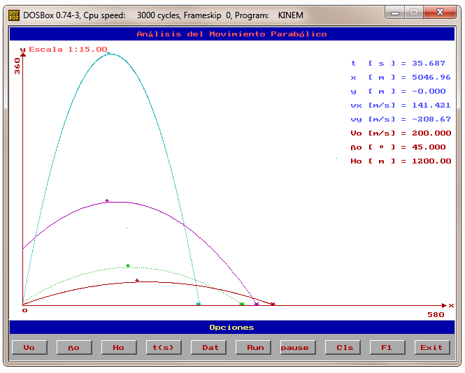

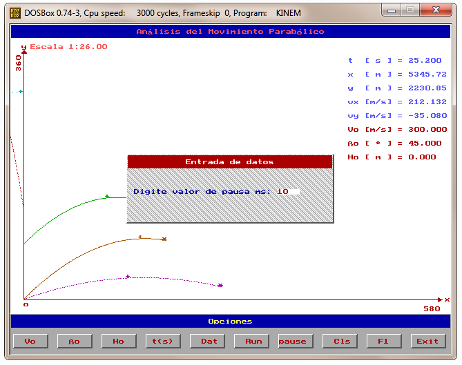

`<EOF>`